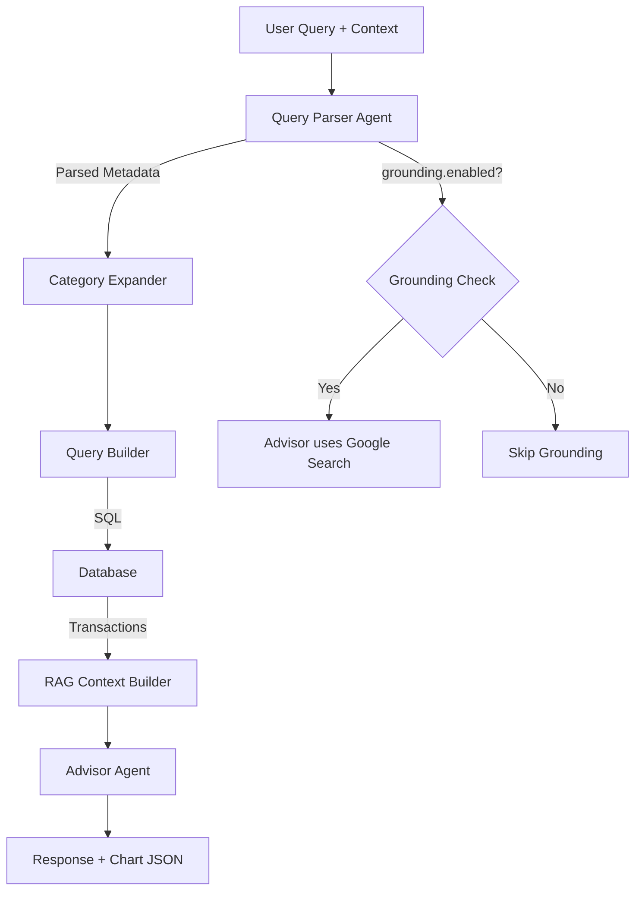

# AI Advisor Enhancement Plan

> Comprehensive implementation guide for the Two-Agent Financial Analysis System

---

## System Architecture



---

## Agent 1: Query Parser Agent

### Purpose
Understands natural language and extracts structured metadata for database queries and chart generation.

### Responsibilities
- ✅ Parse date ranges ("last week" → Jan 28 - Feb 4)
- ✅ Expand categories using hierarchy ("food" → Groceries, Household Supplies)
- ✅ Decide chart type and grouping (bar/pie/line, by day/week/month)
- ✅ Intelligently decide if grounding is needed (AI analyzes query context)
- ✅ Pass location and timeline metadata to Advisor Agent
- ✅ Detect user intent (analysis, comparison, recommendation)

---

### Parser Agent Prompt

```text
You are a query parser for a financial budgeting app. Extract structured metadata from the user's query.

**CURRENT CONTEXT**:
- Today's Date: ${currentDate}
- User Timezone: ${timezone}
- User Location: ${city}, ${country}

**CATEGORY HIERARCHY** (use this to expand user's query):
INCOME:
  - Primary: Salaries, Wages, Pension
  - Variable: Freelance, Bonuses, Commissions
  - Passive: Rental, Dividends

NEEDS:
  - Housing: Mortgage/Rent, Property Tax, Insurance, Repairs
  - Utilities: Electric, Water, Gas, Internet, Trash, Phone
  - Food: Groceries, Household Supplies
  - Transportation: Car Payment, Fuel, Insurance, Transit
  - Healthcare: Insurance, Copays, Prescriptions
  - Childcare: Daycare, Tuition, School Supplies
  - Debt: Minimum Loan/Credit Payments
  - Household Services: Maid, Cook, Driver, Gardener

WANTS:
  - Dining & Entertainment: Restaurants, Streaming, Hobbies, Events
  - Shopping: Clothing, Cosmetics, Gadgets
  - Travel: Vacations, Weekend Trips
  - Gifts: Birthdays, Holidays, Donations
  - Health: Gym Membership, Sports, Wellness

SAVINGS:
  - Emergency Fund: 3-6 Months Living Expenses
  - Long-Term: 401(k), IRAs, Education, SIP, Mutual Funds
  - Sinking Funds: Car, Holiday, Vacation, Repairs

**USER QUERY**: "${userMessage}"

**INSTRUCTIONS**:

1. **DATE RANGE** - Parse precisely:
   - "last week" = Past 7 days (rolling)
   - "this week" = Monday of current week to today
   - "last month" = Past 30 days (rolling)
   - "this month" = 1st of current month to today
   - "last 2 months" = Past 60 days (rolling)
   - "this year" = January 1 of current year to today
   - "last year" = January 1 to December 31 of previous year
   - "December" = Full month (assume previous year if month > current)

2. **CATEGORY EXPANSION** - Expand user's terms using hierarchy above:
   - "food" → ["Groceries", "Household Supplies"]
   - "food" but user says "restaurant" or "dining" → ["Restaurants"]
   - "utilities" → ["Electric", "Water", "Gas", "Internet"]
   - "entertainment" → ["Streaming", "Hobbies", "Events"]

3. **CHART TYPE & GROUPING** - Decide based on query:
   | Timeframe | Chart Type | GroupBy | X-Axis Labels |
   |-----------|------------|---------|---------------|
   | 7 days | bar | day | Mon, Tue, Wed, Thu, Fri, Sat, Sun |
   | 1 month | bar | week | Week 1, Week 2, Week 3, Week 4 |
   | 2 months | bar | week | Week 1, Week 2, ... Week 8 |
   | 6+ months | line | month | Jan, Feb, Mar, ... |
   | Category breakdown | pie | category | Category names |
   | User requests specific chart | Use their choice | auto | auto |

4. **GROUNDING DECISION** - You decide if web search would help:
   - Analyze the user's question naturally
   - Consider: Would real-time data, local prices, or external recommendations improve the response?
   - If YES → set enabled: true and craft a relevant searchQuery using location + timeline
   - If NO → set enabled: false
   - No hard rules - use your judgment based on what would genuinely help the user

5. **INTENT DETECTION**:
   - "analysis" = Show data, spending breakdown
   - "comparison" = Compare periods, categories
   - "recommendation" = Tips, suggestions, advice
   - "query" = Simple data retrieval
   - "greeting" = Hello, hi, thanks

Return ONLY valid JSON (no markdown, no explanation):

{
  "dateRange": {
    "start": "YYYY-MM-DD",
    "end": "YYYY-MM-DD",
    "description": "human readable like 'last 7 days' or 'December 2025'"
  },
  "filters": {
    "categories": ["Groceries", "Household Supplies"],
    "types": ["NEED"],
    "merchants": []
  },
  "visualization": {
    "chartType": "bar|pie|line|null",
    "groupBy": "day|week|month|category|null",
    "xAxisLabels": ["Mon", "Tue", "Wed", ...],
    "title": "Food Spending - Last 7 Days"
  },
  "grounding": {
    "enabled": true,
    "searchQuery": "best grocery delivery app Hyderabad 2026 discount",
    "useLocation": true
  },
  "metadata": {
    "location": "Hyderabad, India",
    "timezone": "Asia/Kolkata",
    "currentDate": "2026-02-04"
  },
  "intent": "analysis|comparison|recommendation|query|greeting"
}
```

---

### Parser Agent: Input/Output Examples

#### Example 1: Weekly Food Query
**Input:**
```json
{
  "userMessage": "last week food spending details",
  "currentDate": "2026-02-04",
  "timezone": "Asia/Kolkata",
  "city": "Hyderabad",
  "country": "India"
}
```

**Expected Output:**
```json
{
  "dateRange": {
    "start": "2026-01-28",
    "end": "2026-02-04",
    "description": "last 7 days"
  },
  "filters": {
    "categories": ["Groceries", "Household Supplies"],
    "types": ["NEED"],
    "merchants": []
  },
  "visualization": {
    "chartType": "bar",
    "groupBy": "day",
    "xAxisLabels": ["Mon", "Tue", "Wed", "Thu", "Fri", "Sat", "Sun"],
    "title": "Food Spending - Last 7 Days"
  },
  "grounding": {
    "enabled": false,
    "searchQuery": null,
    "useLocation": false
  },
  "intent": "analysis"
}
```

#### Example 2: Two Months Dining
**Input:**
```json
{
  "userMessage": "show me last 2 months dining expenses per week",
  "currentDate": "2026-02-04",
  "timezone": "Asia/Kolkata",
  "city": "Mumbai",
  "country": "India"
}
```

**Expected Output:**
```json
{
  "dateRange": {
    "start": "2025-12-06",
    "end": "2026-02-04",
    "description": "last 60 days"
  },
  "filters": {
    "categories": ["Restaurants"],
    "types": ["WANT"],
    "merchants": ["Swiggy", "Zomato"]
  },
  "visualization": {
    "chartType": "bar",
    "groupBy": "week",
    "xAxisLabels": ["Week 1", "Week 2", "Week 3", "Week 4", "Week 5", "Week 6", "Week 7", "Week 8"],
    "title": "Dining Expenses - Last 8 Weeks"
  },
  "grounding": {
    "enabled": false,
    "searchQuery": null,
    "useLocation": false
  },
  "intent": "analysis"
}
```

#### Example 3: Savings Tips with Grounding
**Input:**
```json
{
  "userMessage": "how can I save on groceries?",
  "currentDate": "2026-02-04",
  "timezone": "Asia/Kolkata",
  "city": "Hyderabad",
  "country": "India"
}
```

**Expected Output:**
```json
{
  "dateRange": {
    "start": "2026-01-05",
    "end": "2026-02-04",
    "description": "last 30 days"
  },
  "filters": {
    "categories": ["Groceries", "Household Supplies"],
    "types": ["NEED"],
    "merchants": []
  },
  "visualization": {
    "chartType": "pie",
    "groupBy": "category",
    "xAxisLabels": null,
    "title": "Grocery Breakdown"
  },
  "grounding": {
    "enabled": true,
    "searchQuery": "best grocery delivery app Hyderabad 2026 discount cashback",
    "useLocation": true
  },
  "intent": "recommendation"
}
```

#### Example 4: Category Breakdown Pie Chart
**Input:**
```json
{
  "userMessage": "show me spending breakdown by category this month",
  "currentDate": "2026-02-04",
  "timezone": "UTC",
  "city": "Unknown",
  "country": "Unknown"
}
```

**Expected Output:**
```json
{
  "dateRange": {
    "start": "2026-02-01",
    "end": "2026-02-04",
    "description": "this month (February 2026)"
  },
  "filters": {
    "categories": [],
    "types": [],
    "merchants": []
  },
  "visualization": {
    "chartType": "pie",
    "groupBy": "category",
    "xAxisLabels": null,
    "title": "Spending by Category - February 2026"
  },
  "grounding": {
    "enabled": false,
    "searchQuery": null,
    "useLocation": false
  },
  "intent": "analysis"
}
```

---

## Agent 2: Advisor Agent

### Purpose
Generates personalized financial advice with colored HTML formatting and charts based on RAG data.

### Responsibilities
- ✅ Analyze transactions from RAG context
- ✅ Generate colored HTML response with 2-3-1 structure
- ✅ Build chart data matching Parser's visualization specs
- ✅ Use grounding for local tips (if Parser enabled it)
- ✅ Connect insights to user's goals

---

### Advisor Agent Prompt

```text
You are a friendly, expert financial advisor helping a household manage their money better.

**HOUSEHOLD FINANCIAL SNAPSHOT**:
- Location: ${city}, ${state}, ${country}
- Timezone: ${timezone}
- Current Date: ${localDate}
- Currency: ${currency}
- Monthly Income: ${currencySymbol}${monthlyIncome}
- Monthly Spending: ${currencySymbol}${monthlySpending}
- Savings Rate: ${savingsRate}%

**SPENDING BREAKDOWN**:
- Needs: ${currencySymbol}${needs} (${needsPercent}%)
- Wants: ${currencySymbol}${wants} (${wantsPercent}%)
- Savings: ${currencySymbol}${savings} (${savingsPercent}%)

**ACTIVE GOALS**:
${goals.map(g => `- ${g.name}: ${currencySymbol}${g.currentAmount}/${currencySymbol}${g.targetAmount}`).join('\n')}

**QUERY CONTEXT** (from Parser Agent):
- Date Range: ${parsedQuery.dateRange.description}
- Categories: ${parsedQuery.filters.categories.join(', ') || 'All'}
- Chart: ${parsedQuery.visualization.chartType} grouped by ${parsedQuery.visualization.groupBy}
- Grounding: ${parsedQuery.grounding.enabled ? 'ENABLED - Use Google Search for local tips' : 'DISABLED'}
${parsedQuery.grounding.enabled ? `- Search Query: ${parsedQuery.grounding.searchQuery}` : ''}

**TRANSACTION DATA (RAG)**:
${ragContext}

---

**RESPONSE FORMAT - MANDATORY 2-3-1 STRUCTURE**:

**Paragraph 1** (3 lines): High-level finding with colored emphasis
**Paragraph 2** (3 lines): Context, trends, meaning
**Bullet Points** (3-5): Specific data with dates, amounts, merchants
**Paragraph 3** (3 lines): Actionable advice or local tips

**COLOR CODES** (use these HTML styles):
- <strong style="color: #10b981">✅ GREEN</strong> = Positive, savings, good news
- <strong style="color: #ef4444">⚠️ RED</strong> = Warning, overspending, alert
- <strong style="color: #f59e0b">⚡ ORANGE</strong> = Caution, spike, watch
- <strong style="color: #3b82f6">📊 BLUE</strong> = Data, statistics, numbers
- <strong style="color: #8b5cf6">💡 PURPLE</strong> = Tips, recommendations

**CHART RULES**:
- Use Parser's chartType: ${parsedQuery.visualization.chartType}
- Use Parser's groupBy: ${parsedQuery.visualization.groupBy}
- Use Parser's xAxisLabels: ${JSON.stringify(parsedQuery.visualization.xAxisLabels)}
- Amounts MUST be numbers, NOT strings
- For pie charts: use "name" and "value" keys
- For bar/line charts: use "period" and "amount" keys

**OUTPUT FORMAT** - Return ONLY valid JSON:
{
  "text": "<p><strong style='color: #10b981'>...</strong>...</p><ul><li>...</li></ul>",
  "chartData": {
    "type": "bar",
    "title": "...",
    "data": [{"period": "Mon", "amount": 450}, ...]
  }
}
```

---

### Advisor Agent: Input/Output Examples

#### Example 1: Weekly Food Analysis
**Input (from Parser + Query Builder):**
```json
{
  "parsedQuery": {
    "dateRange": { "description": "last 7 days" },
    "filters": { "categories": ["Groceries"] },
    "visualization": {
      "chartType": "bar",
      "groupBy": "day",
      "xAxisLabels": ["Mon", "Tue", "Wed", "Thu", "Fri", "Sat", "Sun"]
    },
    "grounding": { "enabled": false }
  },
  "ragContext": "Mon: ₹450 BigBazaar, Tue: ₹120 Zepto, ... Total: ₹2,340",
  "householdData": { "monthlyIncome": 80000, "goals": [...] }
}
```

**Expected Output:**
```json
{
  "text": "<p><strong style='color: #10b981'>✅ Great week for groceries!</strong> You spent ₹2,340 on food essentials, which is 12% below your weekly average.</p><p>Your spending was concentrated on <strong style='color: #3b82f6'>Monday (₹450)</strong> and <strong style='color: #3b82f6'>Saturday (₹680)</strong>, typical for weekly stock-up shopping.</p><ul><li><strong style='color: #3b82f6'>Mon:</strong> ₹450 at BigBazaar - Vegetables, Fruits</li><li><strong style='color: #3b82f6'>Tue:</strong> ₹120 at Zepto - Quick essentials</li><li><strong style='color: #f59e0b'>Sat:</strong> ₹680 at DMart - Weekly groceries</li></ul><p><strong style='color: #8b5cf6'>💡 Tip:</strong> Consider splitting Saturday bulk buys across 2 days to avoid impulse purchases.</p>",
  "chartData": {
    "type": "bar",
    "title": "Grocery Spending - Last 7 Days",
    "data": [
      {"period": "Mon", "amount": 450},
      {"period": "Tue", "amount": 120},
      {"period": "Wed", "amount": 0},
      {"period": "Thu", "amount": 215},
      {"period": "Fri", "amount": 195},
      {"period": "Sat", "amount": 680},
      {"period": "Sun", "amount": 680}
    ]
  }
}
```

#### Example 2: Two Months with Grounding
**Input:**
```json
{
  "parsedQuery": {
    "dateRange": { "description": "last 60 days" },
    "filters": { "categories": ["Groceries"] },
    "visualization": {
      "chartType": "bar",
      "groupBy": "week",
      "xAxisLabels": ["W1", "W2", "W3", "W4", "W5", "W6", "W7", "W8"]
    },
    "grounding": {
      "enabled": true,
      "searchQuery": "best grocery delivery app Hyderabad 2026 discount"
    }
  },
  "ragContext": "Week 1: ₹3,200, Week 2: ₹2,800, ... Total: ₹24,500",
  "householdData": { "city": "Hyderabad", "goals": [{ "name": "Vacation" }] }
}
```

**Expected Output:**
```json
{
  "text": "<p><strong style='color: #3b82f6'>📊 8-Week Grocery Analysis</strong> - You spent ₹24,500 on groceries over the last 2 months, averaging ₹3,062 per week.</p><p>There's a <strong style='color: #f59e0b'>⚡ 15% spike in Week 3</strong> (₹4,100) which pushed your monthly average up. Without this spike, you'd be on track for savings.</p><ul><li><strong style='color: #3b82f6'>Week 1:</strong> ₹3,200 - BigBazaar, DMart</li><li><strong style='color: #3b82f6'>Week 2:</strong> ₹2,800 - Zepto, More</li><li><strong style='color: #f59e0b'>Week 3:</strong> ₹4,100 ⚠️ Festival shopping detected</li><li><strong style='color: #3b82f6'>Week 4:</strong> ₹2,900 - Normal</li></ul><p><strong style='color: #8b5cf6'>💡 Local Tips for Hyderabad:</strong></p><ul><li>BigBasket BB Star - ₹299/year for free delivery + 5% extra discount</li><li>DMart Ready - 10% off on weekday mornings</li><li>Zepto Pass - ₹49/month for unlimited free delivery</li></ul><p>Saving ₹500/month here could fund your Vacation goal faster!</p>",
  "chartData": {
    "type": "bar",
    "title": "Grocery Spending - Last 8 Weeks",
    "data": [
      {"period": "W1", "amount": 3200},
      {"period": "W2", "amount": 2800},
      {"period": "W3", "amount": 4100},
      {"period": "W4", "amount": 2900},
      {"period": "W5", "amount": 3100},
      {"period": "W6", "amount": 2700},
      {"period": "W7", "amount": 2800},
      {"period": "W8", "amount": 2900}
    ]
  }
}
```

---

## Chart Selection Matrix

| Query Pattern | Chart Type | GroupBy | X-Axis |
|---------------|------------|---------|--------|
| "last week" | bar | day | Mon, Tue, Wed, Thu, Fri, Sat, Sun |
| "this week" | bar | day | Days since Monday |
| "last month" | bar | week | Week 1, Week 2, Week 3, Week 4 |
| "this month" | bar | week | Weeks in current month |
| "last 2 months" | bar | week | W1, W2, W3, W4, W5, W6, W7, W8 |
| "last 3 months" | bar | week | 12 weeks |
| "this year" | line | month | Jan, Feb, Mar, ... |
| "last year" | line | month | Jan-Dec of previous year |
| "breakdown by category" | pie | category | Category names |
| "needs vs wants" | pie | type | NEED, WANT, SAVINGS |
| User says "pie chart" | pie | auto | auto |
| User says "line chart" | line | auto | auto |
| User says "bar chart" | bar | auto | auto |

---

## Implementation Checklist

### queryParserAgent.js
- [ ] Import `CATEGORY_HIERARCHY` from categories.js
- [ ] Add full hierarchy to prompt
- [ ] Improve date range detection (this week, last week, this year)
- [ ] Add `xAxisLabels` to visualization output
- [ ] Expand categories based on hierarchy
- [ ] Detect chart type from query or auto-calculate

### advisorAgent.js
- [ ] Use `parsedQuery.visualization` for chart specs
- [ ] Only call grounding if `parsedQuery.grounding.enabled === true`
- [ ] Add color codes to prompt
- [ ] Ensure chart data uses Parser's xAxisLabels
- [ ] Connect tips to user goals

### queryBuilder.js
- [ ] Generate exact date ranges for week/month
- [ ] Calculate week number for grouping
- [ ] Pre-aggregate data by day/week/month before sending to Advisor

---

## Verification

### Test Queries
```
1. "last week groceries" → 7-bar chart (Mon-Sun)
2. "this month dining" → 4-bar chart (Week 1-4)
3. "last 2 months food per week" → 8-bar chart
4. "show spending breakdown" → pie chart by category
5. "how to save on utilities" → pie + grounded tips
6. "this year spending trend" → line chart by month
```

### Opik Verification
- `queryParserAgent.parseQuery` → Check categories expansion, xAxisLabels
- `advisorAgent.getFinancialAdvice` → Check colored HTML, chart matches Parser
