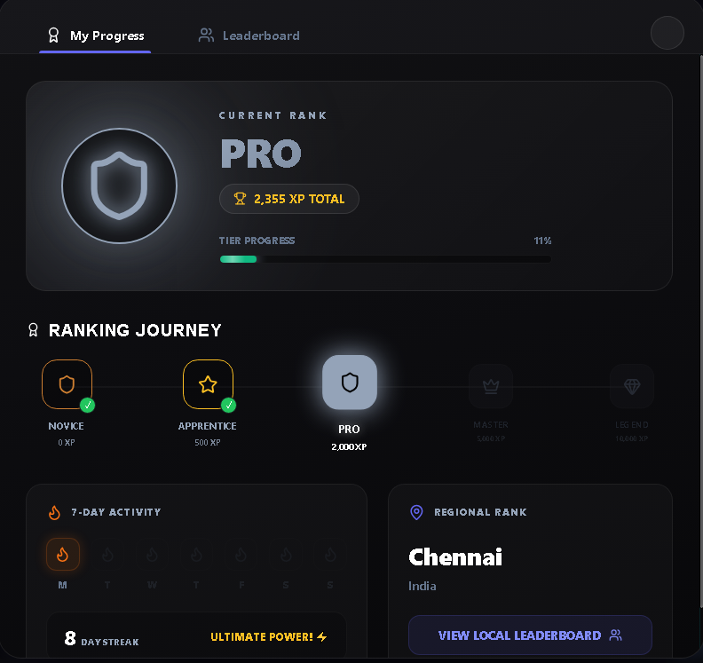
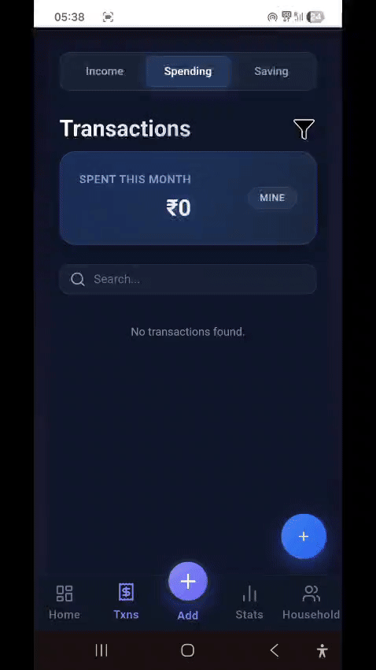
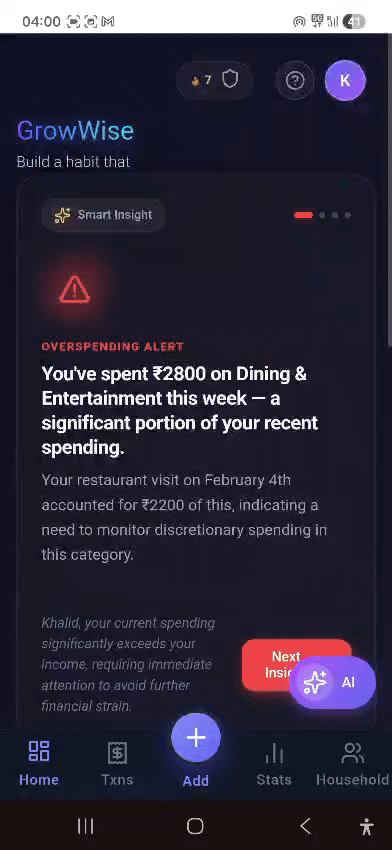
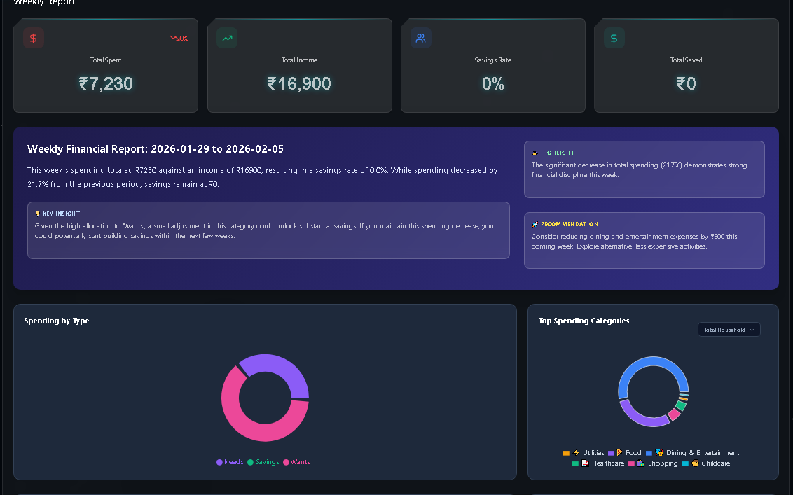
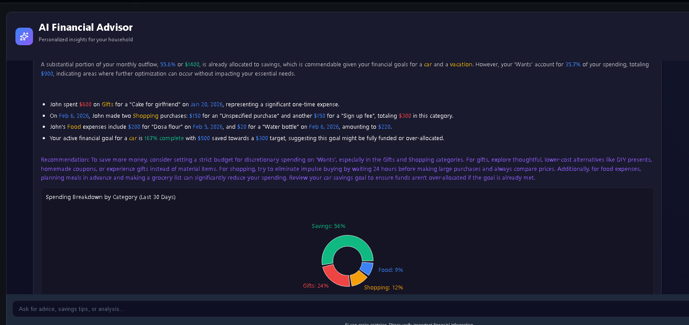

# 🏠 GrowWise: HouseHold Budgeting

### 🌐 [Live Demo (GrowWise)](https://growwise-p20f.onrender.com/)

---

## 🚀 1. Problem Statement

Managing household finances shouldn't be a second full-time job. Traditional budgeting fails because:

*   **Tracking is Exhausting**: Most people struggle to maintain the habit of manually noting every expense, whether on paper or in basic apps.
*   **Manual Tools Lack Insights**: Notes, spreadsheets, and simple apps fail to show clear spending patterns, categories, or long-term trends.
*   **Privacy Concerns**: Many users hesitate to give financial apps direct access to their bank accounts, limiting the adoption of semi-automated tools.
*   **Multi-Person Chaos**: Couples, roommates, and families find it difficult to combine expenses, categorize them (essential vs luxury), and manage multiple income sources/savings goals together.

---

## 💡 2. Why is this a Big Concern?

Financial transparency is the foundation of a healthy household. Ignoring the details leads to:

*   **"Money Leaks"**: Daily tracking reveals small, frequent purchases (like morning coffees or forgotten subscriptions) that can quietly drain hundreds of dollars annually.
*   **Supports Shared Goals**: Without shared tracking, partners aren't aligned on priorities like saving for a home, a child's education, or an emergency fund.
*   **Prevents Debt Spirals**: By not knowing exactly how much you can afford *before* you spend, it's easy to rely on credit cards, leading to high-interest debt accumulation.
*   **Financial Stress**: Replacing "where did my paycheck go?" with a clear sense of control and confidence is vital for mental well-being and relationship harmony.

---

## ✨ 3. The Solution: GrowWise

GrowWise is an **AI-native collaborative budgeting platform** designed to turn financial tracking from a chore into a seamless, insights-driven experience.

*   **Effortless Multi-Person Management**: Built for individuals, couples, and full households with shared visibility and role-based permissions.
*   **Proactive Privacy**: Native-first tracking that doesn't require bank syncing, giving you full control over your data while maintaining smart automation.
*   **AI-Powered Intelligence**: Leverage Google Gemini to categorize, analyze, and advise on your finances in real-time.
*   **Gamified Habit Building**: Using psychological triggers to make budgeting consistent and fun.

---

## 🎮 4. Gamification: Budgeting as a Habit

We've integrated game mechanics to ensure you stay committed to your financial goals:

*   **Streaks & XP**: Gain Experience Points (XP) for every expense added, weekly review completed, or advisor chat. Build streaks to show off your consistency.
*   **Global Rankings**: See how your household compares to the community in saving efficiency (with full privacy).
*   **Challenges**: Join weekly or monthly savings challenges to reach targets faster.

| Global Leaderboard | Personal Streaks |
| :---: | :---: |
|  |  |

---

## 📱 5. About the Platform

GrowWise is a modern **Progressive Web App (PWA)**, offering the best of web and mobile:

*   **Cross-Platform**: Works perfectly on Desktop, Tablet, and Smartphone.
*   **Native Experience**: Install GrowWise to your home screen for a full-screen, app-like experience with fast loading and offline capabilities.
*   **Real-time Sync**: Changes made by one household member are instantly reflected for everyone else.

---

## 🧠 6. AI Features (Functional & Technical)

Our AI suite, powered by **Google Gemini**, acts as your private financial secretary.

### 🎙️ Smart Entry (Multi-Modal Logging)
Stop typing, start talking. Log expenses via voice, text, or a snap of a receipt.
*   **How to use**: Tap the "+" button or microphone icon and say *"Spent 50 dollars on groceries at Walmart"* or upload a photo of your receipt.
*   **Technical**: Deep integration with Gemini Vision/Speech to structure raw input into meaningful data (merchant, amount, category) in under 5 seconds.
*   **Status**: 

### 📊 Live Insight (Natural Language Charts)
Visualize your data by simply asking for it.
*   **How to use**: Type a query like *"Show me my coffee spending vs rent for the last 6 months"* or *"Compare my income to expenses this year"*.
*   **Technical**: Converts natural language into complex database queries and dynamically generates optimized chart configurations (Pie, Bar, Line).
*   **Status**: 

### 📑 AI Report (Automated Intelligence)
Get a "CFO-level" summary of your household's health every week.
*   **How to use**: Reports are automatically generated and available in your Dashboard.
*   **Technical**: Analyzes trends, identifies "hidden leakages," and summarizes your biggest spenders vs your goals.
*   **Preview**: 

### 💬 AI Advisor (Personalized Financial Chat)
A RAG-based advisor that knows your history and helps you plan the future.
*   **How to use**: Open the Advisor tab and ask questions like *"Can I afford a new laptop next month?"* or *"How can I save 200 more dollars this month?"*
*   **Technical**: Uses Retrieval-Augmented Generation (RAG) to ground AI responses in your *actual* transaction history for 100% personalized advice.
*   **Status**: 

---

## 🔭 7. AI Observability with Opik

To ensure 99.9% accuracy and transparency in our AI operations, we use **Opik by Comet** for full LLM observability. We track every "thought" the AI has to prevent hallucinations and optimize performance.

| Feature | Trace Name (Opik) | What We Monitor |
| :--- | :--- | :--- |
| **Smart Entry** | `processSmartEntry` / `analyzeImage` | Accuracy of OCR and intent extraction from voice. |
| **Live Insight** | `queryParserAgent.parseQuery` | Precision in date range extraction and chart selection. |
| **AI Report** | `reportAgent.generateReport` | Mathematical correctness of insights vs database totals. |
| **AI Advisor** | `advisorAgent.getFinancialAdvice` | RAG context retrieval quality and grounding status. |

*Developers can view these traces in the [Opik Dashboard](https://www.comet.com/opik/) to see exactly how Gemini processes each request. Each feature is traced using specific wrappers to capture latency, token usage, and accuracy scores.*

---

## 🛠️ Installation & Setup

1.  **Clone the Repo**: `git clone https://github.com/itskhalid2025/HouseHold-Budgeting.git`
2.  **Environment Variables**: Setup your `.env` with `GEMINI_API_KEY` and `DATABASE_URL`.
3.  **Run Locally**:
    *   `cd backend && npm install && npm start`
    *   `cd frontend && npm install && npm run dev`
4.  **PWA**: Open the app in your mobile browser and select "Add to Home Screen".
