# HomeHarmony Budget - Complete Implementation Plan

> **AI-Powered Financial Clarity for the Whole Household**

---

## Table of Contents
1. [Hackathon Judging Criteria](#hackathon-judging-criteria)
2. [Technical Architecture](#technical-architecture)
3. [Financial Categories Flowchart](#financial-categories-flowchart)
4. [User Registration & Data Requirements](#user-registration--data-requirements)
5. [Member Invitation System](#member-invitation-system)
6. [Smart Data Fetching for AI](#smart-data-fetching-for-ai)
7. [Features Plan](#features-plan)
8. [AI API Call Estimates](#ai-api-call-estimates)
9. [Implementation Phases](#implementation-phases)
10. [Error Handling Strategy](#error-handling-strategy)
11. [Success Metrics](#success-metrics)

---

## Hackathon Judging Criteria

### **1. Functionality: Does the app actually work as intended?**

**How we will address this:**
- **Modular Architecture**: Breaking down features into independent, testable modules (income tracking, expense categorization, AI analysis, visualization)
- **Progressive Enhancement**: Starting with core functionality (manual entry, basic categorization) before adding advanced features (AI insights, multi-user sync)
- **Robust Error Handling**: Implementing try-catch blocks at every API call, validating user inputs, providing graceful fallbacks when AI services fail
- **State Management**: Using React state and persistent storage to ensure data consistency across sessions
- **Responsive Design**: Building mobile-first UI that works seamlessly on all devices
- **Real-time Updates**: Implementing instant household sync when any member logs a transaction
- **Offline Capability**: Core budgeting works without AI; LLM features enhance but don't block functionality

---

### **2. Real-world relevance: How practical and applicable is this solution?**

**How we will address this:**
- **New Year's Resolution Alignment**: Most people resolve to "save more money" and "get financially organized" - our app directly addresses both
- **Practical Features**:
  - Quick voice/text entry for busy families
  - Automated categorization to reduce manual work
  - Weekly pulse reports that take 30 seconds to review
  - Actionable AI suggestions (not just data dumps)
  - Sinking funds for real goals (vacation, car repair, holiday gifts)
- **Needs vs Wants Framework**: Psychological approach to budgeting that helps users understand spending psychology
- **Accessibility**: Free tier using Gemini API makes it available to everyone
- **Multi-user Design**: Recognizes that household finances are collaborative
- **Family-Friendly**: Role-based permissions allow kids to view but not edit

---

### **3. Use of LLMs/Agents: How effectively does the project use LLMs?**

**How we will address this:**
- **Multi-Agent Architecture**:
  1. **Categorization Agent**: Analyzes transaction descriptions to auto-classify as Needs/Wants and assign sub-categories
  2. **Analysis Agent**: Reviews spending patterns and generates weekly/monthly insights
  3. **Advisory Agent**: Provides personalized savings recommendations based on household context
  4. **Visualization Agent**: Converts natural language queries into chart specifications

- **Agentic Capabilities**:
  - **Reasoning Chains**: Multi-step analysis (detect pattern → compare to goals → generate specific recommendation)
  - **Autonomy**: Proactive weekly reports without user prompting
  - **Contextual Memory**: Tracks household goals, previous recommendations, and user preferences
  - **Tool Use**: Generates charts, calculates debt payoff strategies, creates meal plans
  - **Retrieval**: References past spending data and user-defined budgets to provide context-aware advice

---

### **4. Evaluation and observability: Has the team implemented ways to evaluate?**

**How we will address this:**
- **Opik Integration at Every Layer**:
  - **Trace Level**: Every AI API call logged with input prompts, outputs, latency, token usage
  - **Span Level**: Breaking down complex operations (e.g., "Generate Weekly Report" → categorize transactions → analyze trends → generate visualizations → compile insights)
  - **Dataset Level**: Creating golden datasets for testing categorization accuracy, advice quality

- **Evaluation Metrics**:
  - **Categorization Accuracy**: Human-validated test set of 200 transactions, measuring precision/recall
  - **Advice Quality**: LLM-as-judge scoring relevance (1-5), actionability (1-5), tone (1-5)
  - **Response Time**: P50/P95 latency tracking for real-time features
  - **Cost Efficiency**: Tracking token usage per feature to optimize prompts
  - **Error Rate**: Monitoring API failures, categorization edge cases, invalid chart requests

- **Human-in-the-Loop**:
  - User feedback buttons on AI suggestions (helpful/not helpful)
  - Manual override for incorrect categorizations (fed back into evaluation dataset)

---

### **5. Goal Alignment: How well is Opik integrated into the development workflow?**

**How we will address this:**
- **Opik as Development Foundation**:
  - **Experiment Tracking**: Every prompt variation logged as an experiment with A/B test results
  - **Model Version Comparison**: Testing Gemini 1.5 Flash vs Pro for different tasks, comparing cost/quality tradeoffs
  - **Evaluation Runs**: Automated regression tests on every code commit using fixed test datasets
  
- **Development Workflow**:
  1. Write new feature → Tag as Opik experiment
  2. Run against test dataset → Log metrics
  3. Compare to baseline → Decision to deploy or iterate
  4. Deploy → Monitor production traces
  5. Collect user feedback → Update evaluation dataset

- **Dashboard Presentation for Judges**:
  - **Experiment Dashboard**: Showing 10+ prompt iterations with quality improvements over time
  - **Trace Explorer**: Live view of AI reasoning chains during demo
  - **Evaluation Results**: Side-by-side comparison of model versions on categorization task
  - **Cost Analytics**: Token usage breakdown by feature, showing optimization over development period
  - **Error Analysis**: Common failure modes and how we addressed them

---

## Technical Architecture

### **Technology Stack**

#### Frontend
| Technology | Purpose |
|------------|---------|
| **React 18** | UI framework with Hooks for state management |
| **Vite** | Build tool and dev server |
| **React Router v6** | Client-side routing |
| **Recharts** | Chart visualization library |
| **TailwindCSS** | Utility-first styling (optional) |
| **Web Speech API** | Voice input transcription |

#### Backend
| Technology | Purpose |
|------------|---------|
| **Node.js + Express** | REST API server |
| **PostgreSQL** | Primary database |
| **Prisma ORM** | Database access and migrations |
| **JWT** | Authentication tokens |
| **bcrypt** | Password hashing |
| **Socket.io** | Real-time household sync |

#### AI & Observability
| Technology | Purpose |
|------------|---------|
| **Google Gemini API** | LLM for categorization, analysis, advice |
| **Opik (Comet)** | LLM tracing, evaluation, experiments |

#### DevOps
| Technology | Purpose |
|------------|---------|
| **Docker** | Containerization |
| **GitHub Actions** | CI/CD pipeline |
| **Vercel** | Frontend hosting |
| **Railway/Render** | Backend hosting |

### **System Architecture Diagram**

```
┌─────────────────────────────────────────────────────────────────────────┐
│                              FRONTEND (React)                            │
│  ┌─────────────┐  ┌─────────────┐  ┌─────────────┐  ┌─────────────────┐ │
│  │  Dashboard  │  │ Transactions│  │   Reports   │  │  AI Assistant   │ │
│  │    Page     │  │    Page     │  │    Page     │  │    Chat Page    │ │
│  └─────────────┘  └─────────────┘  └─────────────┘  └─────────────────┘ │
│                            ↓ HTTP/WebSocket ↓                            │
└─────────────────────────────────────────────────────────────────────────┘
                                      │
                                      ▼
┌─────────────────────────────────────────────────────────────────────────┐
│                        BACKEND (Node.js + Express)                       │
│  ┌──────────────────────────────────────────────────────────────────┐   │
│  │                         API ROUTES                                │   │
│  │  /api/auth    /api/users    /api/households    /api/transactions │   │
│  │  /api/income  /api/reports  /api/ai            /api/invitations  │   │
│  └──────────────────────────────────────────────────────────────────┘   │
│                                   │                                      │
│  ┌──────────────┐  ┌──────────────┐  ┌──────────────────────────────┐   │
│  │   Services   │  │  AI Agents   │  │      Opik Integration        │   │
│  │  (Business   │  │ (Gemini API) │  │   (Tracing & Evaluation)     │   │
│  │   Logic)     │  │              │  │                              │   │
│  └──────────────┘  └──────────────┘  └──────────────────────────────┘   │
│                                   │                                      │
│                    ┌──────────────────────────────┐                      │
│                    │      Data Access Layer       │                      │
│                    │         (Prisma ORM)         │                      │
│                    └──────────────────────────────┘                      │
└─────────────────────────────────────────────────────────────────────────┘
                                      │
                                      ▼
                    ┌──────────────────────────────┐
                    │        PostgreSQL DB         │
                    │  Users, Households, Transactions,│
                    │  Income, Goals, Invitations  │
                    └──────────────────────────────┘
```

### **Authorization & Security**

#### Tools Requiring Authorization

| Tool/Endpoint | Auth Required | Role Required | Description |
|---------------|---------------|---------------|-------------|
| `POST /api/auth/register` | No | - | User registration |
| `POST /api/auth/login` | No | - | User login |
| `GET /api/households/:id` | Yes | Member | View household data |
| `PUT /api/households/:id` | Yes | Admin | Update household settings |
| `POST /api/invitations` | Yes | Admin | Send member invitation |
| `POST /api/transactions` | Yes | Member | Add transaction |
| `DELETE /api/transactions/:id` | Yes | Admin/Owner | Delete transaction |
| `GET /api/reports/weekly` | Yes | Member | View weekly report |
| `POST /api/ai/categorize` | Yes | Member | AI categorization |
| `POST /api/ai/advice` | Yes | Member | AI financial advice |
| `POST /api/ai/chart` | Yes | Member | Natural language charts |
| `PUT /api/users/:id` | Yes | Self/Admin | Update user profile |
| `DELETE /api/households/members/:id` | Yes | Admin | Remove member |

#### JWT Token Structure
```javascript
{
  "userId": "uuid",
  "email": "user@example.com",
  "householdId": "uuid",
  "role": "admin" | "editor" | "viewer",
  "exp": 1234567890
}
```

### **Gemini API Free Tier Constraints**
- **Rate Limits**: 15 requests per minute (RPM), 1 million tokens per minute (TPM), 1,500 requests per day (RPD)
- **Model**: Gemini 1.5 Flash (optimized for speed and cost)
- **Strategy**: Batch operations, cache common prompts, progressive enhancement

---

## Financial Categories Flowchart

```mermaid
flowchart TB
    subgraph INCOME["📥 INCOME TRACKING"]
        direction TB
        I1["💰 Primary Income"]
        I1a["Salaries"]
        I1b["Wages"]
        I1c["Pension Benefits"]
        
        I2["📊 Variable Income"]
        I2a["Freelance/Side-hustle"]
        I2b["Bonuses"]
        I2c["Commissions"]
        
        I3["🏦 Passive Income"]
        I3a["Rental Income"]
        I3b["Investment Dividends"]
        
        I1 --> I1a & I1b & I1c
        I2 --> I2a & I2b & I2c
        I3 --> I3a & I3b
    end

    subgraph BUDGET["💵 MONTHLY BUDGET"]
        B1["Total Monthly Income"]
    end

    subgraph NEEDS["🏠 NEEDS (Essential Expenses)"]
        direction TB
        N1["🏡 Housing"]
        N1a["Mortgage/Rent"]
        N1b["Property Tax"]
        N1c["Home Insurance"]
        N1d["Repairs"]
        
        N2["⚡ Utilities"]
        N2a["Electric"]
        N2b["Water"]
        N2c["Gas"]
        N2d["Internet"]
        N2e["Trash"]
        N2f["Phone"]
        
        N3["🛒 Food"]
        N3a["Groceries"]
        N3b["Household Supplies"]
        
        N4["🚗 Transportation"]
        N4a["Car Payments"]
        N4b["Fuel"]
        N4c["Insurance"]
        N4d["Public Transit"]
        
        N5["🏥 Healthcare"]
        N5a["Insurance Premiums"]
        N5b["Copays"]
        N5c["Prescriptions"]
        
        N6["👶 Childcare"]
        N6a["Daycare"]
        N6b["Tuition"]
        N6c["School Supplies"]
        
        N7["💳 Debt Payments"]
        N7a["Min Loan Payments"]
        N7b["Min Credit Card"]
        
        N1 --> N1a & N1b & N1c & N1d
        N2 --> N2a & N2b & N2c & N2d & N2e & N2f
        N3 --> N3a & N3b
        N4 --> N4a & N4b & N4c & N4d
        N5 --> N5a & N5b & N5c
        N6 --> N6a & N6b & N6c
        N7 --> N7a & N7b
    end

    subgraph WANTS["🎯 WANTS (Discretionary)"]
        direction TB
        W1["🍽️ Dining & Entertainment"]
        W1a["Restaurants"]
        W1b["Streaming Services"]
        W1c["Hobbies"]
        W1d["Events/Concerts"]
        
        W2["🛍️ Shopping"]
        W2a["Clothing"]
        W2b["Cosmetics"]
        W2c["Non-essential Gadgets"]
        
        W3["✈️ Travel"]
        W3a["Vacations"]
        W3b["Weekend Getaways"]
        
        W4["🎁 Gifts"]
        W4a["Birthdays"]
        W4b["Holidays"]
        W4c["Donations"]
        
        W1 --> W1a & W1b & W1c & W1d
        W2 --> W2a & W2b & W2c
        W3 --> W3a & W3b
        W4 --> W4a & W4b & W4c
    end

    subgraph SAVINGS["💎 SAVINGS & INVESTMENTS"]
        direction TB
        S1["🏦 Emergency Fund"]
        S1a["3-6 Months Living Expenses"]
        
        S2["📈 Long-Term Growth"]
        S2a["401k"]
        S2b["IRAs"]
        S2c["Education Funds"]
        
        S3["🎯 Sinking Funds"]
        S3a["New Car Fund"]
        S3b["Holiday Fund"]
        S3c["Vacation Fund"]
        S3d["Home Repair Fund"]
        
        S1 --> S1a
        S2 --> S2a & S2b & S2c
        S3 --> S3a & S3b & S3c & S3d
    end

    INCOME --> BUDGET
    BUDGET --> NEEDS
    BUDGET --> WANTS
    BUDGET --> SAVINGS
    
    style INCOME fill:#e8f5e9,stroke:#4caf50
    style NEEDS fill:#fff3e0,stroke:#ff9800
    style WANTS fill:#fce4ec,stroke:#e91e63
    style SAVINGS fill:#e3f2fd,stroke:#2196f3
    style BUDGET fill:#f3e5f5,stroke:#9c27b0
```



### Category Hierarchy Table

| Type | Category | Subcategories |
|------|----------|---------------|
| **INCOME** | Primary | Salaries, Wages, Pension |
| **INCOME** | Variable | Freelance, Bonuses, Commissions |
| **INCOME** | Passive | Rental, Dividends |
| **NEEDS** | Housing | Mortgage/Rent, Property Tax, Insurance, Repairs |
| **NEEDS** | Utilities | Electric, Water, Gas, Internet, Trash, Phone |
| **NEEDS** | Food | Groceries, Household Supplies |
| **NEEDS** | Transportation | Car Payment, Fuel, Insurance, Transit |
| **NEEDS** | Healthcare | Insurance, Copays, Prescriptions |
| **NEEDS** | Childcare | Daycare, Tuition, School Supplies |
| **NEEDS** | Debt | Minimum Loan/Credit Payments |
| **WANTS** | Dining & Entertainment | Restaurants, Streaming, Hobbies, Events |
| **WANTS** | Shopping | Clothing, Cosmetics, Gadgets |
| **WANTS** | Travel | Vacations, Weekend Trips |
| **WANTS** | Gifts | Birthdays, Holidays, Donations |
| **SAVINGS** | Emergency Fund | 3-6 Months Living Expenses |
| **SAVINGS** | Long-Term | 401(k), IRAs, Education |
| **SAVINGS** | Sinking Funds | Car, Holiday, Vacation, Repairs |

---

## User Registration & Data Requirements

### Registration Flow

```
┌─────────────────┐     ┌─────────────────┐     ┌─────────────────┐
│   Registration  │ ──► │   Verification  │ ──► │   Household     │
│      Form       │     │     (Email)     │     │     Setup       │
└─────────────────┘     └─────────────────┘     └─────────────────┘
```

### Required Registration Data

| Field | Type | Validation | Required | Notes |
|-------|------|------------|----------|-------|
| **email** | String | Valid email format, unique | ✅ Yes | Primary identifier |
| **phone** | String | Valid phone format, unique | ✅ Yes | Alternative identifier |
| **password** | String | Min 8 chars, 1 uppercase, 1 number | ✅ Yes | Hashed with bcrypt |
| **firstName** | String | 2-50 characters | ✅ Yes | Display name |
| **lastName** | String | 2-50 characters | ✅ Yes | Display name |
| **currency** | Enum | USD, EUR, GBP, INR, etc. | ✅ Yes | Default currency |

### Optional Profile Data (Can be added after registration)

| Field | Type | Purpose |
|-------|------|---------|
| **avatar** | URL | Profile picture |
| **timezone** | String | Report scheduling |
| **notificationPreferences** | JSON | Email/Push settings |
| **monthlyIncomeEstimate** | Number | Budget planning |
| **savingsGoal** | Number | AI recommendations |

### Database Schema - Users Table

```sql
CREATE TABLE users (
  id UUID PRIMARY KEY DEFAULT gen_random_uuid(),
  email VARCHAR(255) UNIQUE NOT NULL,
  phone VARCHAR(20) UNIQUE NOT NULL,
  password_hash VARCHAR(255) NOT NULL,
  first_name VARCHAR(50) NOT NULL,
  last_name VARCHAR(50) NOT NULL,
  currency VARCHAR(3) NOT NULL DEFAULT 'USD',
  avatar_url TEXT,
  timezone VARCHAR(50) DEFAULT 'UTC',
  notification_preferences JSONB DEFAULT '{}',
  household_id UUID REFERENCES households(id),
  role VARCHAR(20) DEFAULT 'viewer',
  email_verified BOOLEAN DEFAULT false,
  phone_verified BOOLEAN DEFAULT false,
  created_at TIMESTAMP DEFAULT NOW(),
  updated_at TIMESTAMP DEFAULT NOW()
);

-- Unique constraints for identifying users
CREATE UNIQUE INDEX users_email_idx ON users(email);
CREATE UNIQUE INDEX users_phone_idx ON users(phone);
```

---

## Member Invitation System

### Invitation Flow

```
┌───────────────┐     ┌───────────────┐     ┌───────────────┐     ┌───────────────┐
│ Admin sends   │ ──► │ System creates│ ──► │ Invitee gets  │ ──► │ Invitee joins │
│ invite via    │     │ invitation    │     │ email/SMS     │     │ household     │
│ email/phone   │     │ with token    │     │ notification  │     │               │
└───────────────┘     └───────────────┘     └───────────────┘     └───────────────┘
```

### Invitation Methods

#### 1. Email Invitation
```javascript
// API Request
POST /api/invitations
{
  "method": "email",
  "recipient": "family.member@email.com",
  "role": "editor"  // admin | editor | viewer
}

// Email sent contains:
// - Personalized message from household admin
// - Unique invite link with token
// - Expiry: 7 days
```

#### 2. Phone/SMS Invitation
```javascript
// API Request
POST /api/invitations
{
  "method": "phone",
  "recipient": "+1234567890",
  "role": "viewer"
}

// SMS sent contains:
// - Short invite link with token
// - Household name
// - Expiry: 7 days
```

### Invitation Database Schema

```sql
CREATE TABLE invitations (
  id UUID PRIMARY KEY DEFAULT gen_random_uuid(),
  household_id UUID NOT NULL REFERENCES households(id),
  invited_by UUID NOT NULL REFERENCES users(id),
  recipient_email VARCHAR(255),
  recipient_phone VARCHAR(20),
  role VARCHAR(20) NOT NULL,
  token VARCHAR(64) UNIQUE NOT NULL,
  status VARCHAR(20) DEFAULT 'pending', -- pending, accepted, expired, cancelled
  expires_at TIMESTAMP NOT NULL,
  accepted_at TIMESTAMP,
  created_at TIMESTAMP DEFAULT NOW(),
  
  -- At least one contact method required
  CONSTRAINT contact_required CHECK (
    recipient_email IS NOT NULL OR recipient_phone IS NOT NULL
  )
);

-- Prevent duplicate invitations
CREATE UNIQUE INDEX inv_household_email_idx 
  ON invitations(household_id, recipient_email) 
  WHERE status = 'pending';
CREATE UNIQUE INDEX inv_household_phone_idx 
  ON invitations(household_id, recipient_phone) 
  WHERE status = 'pending';
```

### Joining via Invitation

```javascript
// Accept invitation (existing user)
POST /api/invitations/:token/accept
Authorization: Bearer <jwt_token>

// Accept invitation (new user - redirects to registration)
GET /api/invitations/:token/register
// Pre-fills email/phone from invitation
// After registration, auto-joins household
```

### Role Permissions Matrix

| Permission | Admin | Editor | Viewer |
|------------|-------|--------|--------|
| View all transactions | ✅ | ✅ | ✅ |
| Add own transactions | ✅ | ✅ | ✅ |
| Edit own transactions | ✅ | ✅ | ❌ |
| Delete own transactions | ✅ | ✅ | ❌ |
| Edit others' transactions | ✅ | ❌ | ❌ |
| Manage budget categories | ✅ | ✅ | ❌ |
| Set savings goals | ✅ | ✅ | ❌ |
| Invite new members | ✅ | ❌ | ❌ |
| Remove members | ✅ | ❌ | ❌ |
| Change member roles | ✅ | ❌ | ❌ |
| View reports | ✅ | ✅ | ✅ |
| Delete household | ✅ | ❌ | ❌ |

---

## Smart Data Fetching for AI

### The Problem
AI requests often need household context, but sending ALL data wastes tokens and increases latency.

### The Solution: Selective Data Context

Instead of sending everything, we fetch only what the AI needs for each specific task.

### Data Context Types

```javascript
// 1. CATEGORIZATION CONTEXT (Minimal)
const categorizationContext = {
  transaction: {
    description: "Starbucks card payment",
    amount: 5.50,
    merchant: "Starbucks"
  },
  // Only include recent similar transactions for context
  recentSimilar: [
    { description: "Starbucks", category: "Dining", type: "Want" }
  ]
};
// Total: ~100 tokens

// 2. WEEKLY REPORT CONTEXT (Summary)
const weeklyReportContext = {
  period: { start: "2024-01-08", end: "2024-01-14" },
  summary: {
    totalSpent: 1245.00,
    byCategory: {
      "Groceries": 380,
      "Dining": 120,
      "Transportation": 95
      // ... aggregated, not individual transactions
    },
    budgetStatus: { used: 78, remaining: 22 },
    comparedToLastWeek: "+5%"
  },
  goals: ["Emergency Fund: 45% complete"]
};
// Total: ~200 tokens

// 3. SAVINGS ADVICE CONTEXT (Targeted)
const savingsAdviceContext = {
  monthlyIncome: 5000,
  spending: {
    needs: 2500,
    wants: 1200,
    savings: 300
  },
  topWantsCategories: [
    { name: "Dining Out", amount: 450, trend: "+25%" },
    { name: "Entertainment", amount: 200, trend: "stable" }
  ],
  activeGoals: [
    { name: "Emergency Fund", target: 10000, current: 4500 }
  ],
  previousRecommendations: [
    { date: "2024-01-07", suggestion: "Reduce dining", status: "not_implemented" }
  ]
};
// Total: ~250 tokens

// 4. CHART GENERATION CONTEXT (Schema Only)
const chartContext = {
  userQuery: "Show dining vs groceries last 3 months",
  availableData: {
    categories: ["Housing", "Utilities", "Groceries", "Dining", ...],
    dateRange: { min: "2023-01-01", max: "2024-01-14" },
    metrics: ["amount", "count", "average"]
  }
  // Actual data fetched AFTER AI generates query spec
};
// Total: ~150 tokens
```

### Data Fetching Service

```javascript
// services/aiContextService.js

class AIContextService {
  
  /**
   * Get minimal context for transaction categorization
   */
  async getCategorizationContext(householdId, transaction) {
    // Fetch only 5 most recent similar transactions
    const similar = await db.transaction.findMany({
      where: {
        householdId,
        OR: [
          { merchant: { contains: transaction.merchant } },
          { description: { contains: transaction.description.split(' ')[0] } }
        ]
      },
      take: 5,
      orderBy: { createdAt: 'desc' },
      select: { description: true, category: true, type: true }
    });
    
    return {
      transaction: {
        description: transaction.description,
        amount: transaction.amount,
        merchant: transaction.merchant
      },
      recentSimilar: similar
    };
  }
  
  /**
   * Get aggregated context for weekly report
   */
  async getWeeklyReportContext(householdId, weekStart, weekEnd) {
    // Aggregate transactions, don't send individuals
    const summary = await db.$queryRaw`
      SELECT 
        category,
        SUM(amount) as total,
        COUNT(*) as count
      FROM transactions
      WHERE household_id = ${householdId}
        AND date BETWEEN ${weekStart} AND ${weekEnd}
      GROUP BY category
    `;
    
    const lastWeekTotal = await db.transaction.aggregate({
      where: {
        householdId,
        date: {
          gte: subDays(weekStart, 7),
          lt: weekStart
        }
      },
      _sum: { amount: true }
    });
    
    return {
      period: { start: weekStart, end: weekEnd },
      summary: this.formatSummary(summary),
      comparedToLastWeek: this.calculateChange(summary, lastWeekTotal)
    };
  }
  
  /**
   * Get targeted context for savings advice
   */
  async getSavingsAdviceContext(householdId) {
    // Only fetch what the advisor needs
    const [income, spending, goals] = await Promise.all([
      this.getMonthlyIncome(householdId),
      this.getSpendingByType(householdId),
      this.getActiveGoals(householdId)
    ]);
    
    // Get top 5 discretionary categories only
    const topWants = await db.transaction.groupBy({
      by: ['category'],
      where: {
        householdId,
        type: 'Want',
        date: { gte: startOfMonth(new Date()) }
      },
      _sum: { amount: true },
      orderBy: { _sum: { amount: 'desc' } },
      take: 5
    });
    
    return {
      monthlyIncome: income,
      spending,
      topWantsCategories: topWants,
      activeGoals: goals
    };
  }
}
```

### Token Usage Comparison

| Request Type | Without Smart Fetch | With Smart Fetch | Savings |
|--------------|---------------------|------------------|---------|
| Categorization | ~500 tokens | ~100 tokens | **80%** |
| Weekly Report | ~2000 tokens | ~200 tokens | **90%** |
| Savings Advice | ~1500 tokens | ~250 tokens | **83%** |
| Chart Query | ~1000 tokens | ~150 tokens | **85%** |

---

## Features Plan

### 1. Input Processing System

#### 1.1 Text Input
- **Natural Language Parser**: Extract amount, merchant, date, category hints
- **Quick Entry Shortcuts**: "50 groceries" → $50 in Groceries

#### 1.2 Audio Input
- **Speech-to-Text via Web Speech API**: Real-time transcription
- **Voice Command Recognition**: "Add expense...", "Show my spending..."

#### 1.3 Transaction Extraction
- **Entity Recognition**: Amount, date, merchant identification
- **Confidence Scoring**: High confidence → auto-commit; Low → ask confirmation

### 2. Budget Intelligence (AI Core)

#### 2.1 Smart Categorization
- Needs vs Wants classification
- Sub-category mapping with learning from corrections

#### 2.2 Spending Analysis Agent
- Pattern detection and budget alerts
- Recurring transaction identification

#### 2.3 Chart Generation
- Natural language to visualization
- Multiple chart types (pie, bar, line, gauge)

#### 2.4 Savings Guidance Engine
- Proactive suggestions with impact calculations
- Debt payoff optimization (Avalanche/Snowball)
- Goal tracking with projections

### 3. Multi-User Household Features

#### 3.1 User Management
- Registration with email + phone (both unique)
- JWT-based session management
- Profile settings

#### 3.2 Household Syncing
- Real-time updates via Socket.io
- Transaction ownership tracking

#### 3.3 Role Management
- Admin, Editor, Viewer roles
- Permission-based access control

### 4. Reporting & Visualization

#### 4.1 Weekly Pulse Report
- Auto-generated every Sunday
- Spending by category, budget status, trends

#### 4.2 Monthly Summary
- Income vs expenses, savings rate
- PDF export capability

#### 4.3 Custom Reports
- Natural language queries
- Interactive dashboards with filters

---

## AI API Call Estimates

### Per-Session Estimates (Using Gemini Free Tier)

| Feature | Calls/Use | Daily Usage | Daily Calls | Context Tokens |
|---------|-----------|-------------|-------------|----------------|
| Text Transaction Parsing | 1 | 5 transactions | 5 | 100 |
| Audio Transcription + Parsing | 2 | 2 audio inputs | 4 | 150 |
| Smart Categorization | 0.5* | 7 transactions | 4 | 100 |
| Budget Query (Q&A) | 1 | 3 queries | 3 | 250 |
| Chart Generation | 1 | 2 charts | 2 | 150 |
| Weekly Report | 3 | 0.14 (1/week) | 0.4 | 200 |
| Savings Advice | 2 | 0.5 requests | 1 | 250 |
| Opik LLM-as-Judge | 1** | 3 evaluations | 3 | 300 |

**Total Estimated Daily Calls: ~22 per user**

\* Batch processing multiple transactions
\** Runs on sampled subset of interactions

### Monthly Estimate per Household (4 users)
- Daily: ~88 calls
- Weekly: ~616 calls
- Monthly: ~2,600 calls
- **Well within free tier** (1,500 RPD × 30 = 45,000 limit) ✅

---

## Implementation Phases

### Phase 1: Project Setup & Core Infrastructure (Days 1-3)

#### Tasks
1. Initialize monorepo with frontend (React/Vite) and backend (Node/Express)
2. Set up PostgreSQL database with Prisma
3. Configure Gemini API integration
4. Set up Opik for LLM observability
5. Create environment configuration

#### File Structure
```
household-budgeting/
├── frontend/
│   ├── src/
│   │   ├── components/
│   │   ├── pages/
│   │   ├── hooks/
│   │   ├── services/
│   │   └── utils/
│   ├── package.json
│   └── vite.config.js
├── backend/
│   ├── src/
│   │   ├── routes/
│   │   ├── controllers/
│   │   ├── services/
│   │   ├── agents/
│   │   ├── middleware/
│   │   └── utils/
│   ├── prisma/
│   │   └── schema.prisma
│   ├── package.json
│   └── server.js
├── shared/
│   └── types/
├── docker-compose.yml
└── README.md
```

#### Testing Method
| Test Type | Method | Tool |
|-----------|--------|------|
| API connectivity | Manual | Postman/curl |
| Database connection | Manual | Prisma Studio |
| Gemini API | Manual + Opik | Test script + Opik trace |
| Opik setup | Manual | Opik dashboard verification |

#### Input/Output Examples

**Test: Gemini API Connection**
```javascript
// Input
const prompt = "Categorize: Starbucks $5.50";

// Expected Output
{
  "type": "Want",
  "category": "Dining",
  "subcategory": "Coffee",
  "confidence": 0.95
}
```

**Test: Opik Trace Verification**
```javascript
// Input: Same as above
// Expected: Trace visible in Opik dashboard with:
// - Input prompt
// - Output response
// - Latency
// - Token count
```

#### Error Handling
- API key validation on startup
- Database connection retry with exponential backoff
- Graceful fallback if Opik unreachable

---

### Phase 2: Authentication & User Management (Days 4-5)

#### Tasks
1. Implement user registration with email + phone validation
2. Build login with JWT tokens
3. Create password reset flow
4. Add session management

#### Testing Method
| Test Type | Method | Tool |
|-----------|--------|------|
| Registration | Manual + Unit | Jest + Postman |
| Login flow | Manual + Unit | Jest + Postman |
| JWT validation | Unit | Jest |
| Duplicate detection | Unit | Jest |

#### Input/Output Examples

**Test: User Registration**
```javascript
// Input
POST /api/auth/register
{
  "email": "user@example.com",
  "phone": "+1234567890",
  "password": "SecurePass123",
  "firstName": "John",
  "lastName": "Doe",
  "currency": "USD"
}

// Expected Output (Success)
{
  "success": true,
  "user": {
    "id": "uuid",
    "email": "user@example.com",
    "firstName": "John",
    "lastName": "Doe"
  },
  "token": "jwt_token_here"
}

// Expected Output (Duplicate Email)
{
  "success": false,
  "error": "Email already registered"
}
```

#### Error Handling
- Validate email/phone format before database check
- Return specific error messages for each validation failure
- Log failed registration attempts for security monitoring

---

### Phase 3: Household & Invitation System (Days 6-7)

#### Tasks
1. Implement household creation
2. Build invitation system (email + phone)
3. Create role-based permissions
4. Set up real-time sync with Socket.io

#### Testing Method
| Test Type | Method | Tool |
|-----------|--------|------|
| Household CRUD | Manual + Unit | Jest + Postman |
| Invitation flow | Manual | End-to-end |
| Role permissions | Unit | Jest |
| Real-time sync | Manual | Two browser tabs |

#### Input/Output Examples

**Test: Send Invitation**
```javascript
// Input
POST /api/invitations
Authorization: Bearer <admin_token>
{
  "method": "email",
  "recipient": "family@example.com",
  "role": "editor"
}

// Expected Output
{
  "success": true,
  "invitation": {
    "id": "uuid",
    "status": "pending",
    "expiresAt": "2024-01-23T00:00:00Z"
  }
}
```

**Test: Accept Invitation**
```javascript
// Input
POST /api/invitations/abc123xyz/accept
Authorization: Bearer <invitee_token>

// Expected Output
{
  "success": true,
  "household": {
    "id": "uuid",
    "name": "Smith Family",
    "yourRole": "editor"
  }
}
```

#### Error Handling
- Check invitation expiry before processing
- Validate token hasn't been used
- Verify invitee email/phone matches invitation

---

### Phase 4: Transaction & Income Tracking (Days 8-10)

#### Tasks
1. Build transaction CRUD operations
2. Implement income tracking
3. Create voice input with Web Speech API
4. Add Opik tracing for all inputs

#### Testing Method
| Test Type | Method | Tool |
|-----------|--------|------|
| Transaction CRUD | Manual + Unit | Jest + Postman |
| Voice input | Manual | Browser testing |
| Income tracking | Manual + Unit | Jest + Postman |
| Opik tracing | Opik | Dashboard verification |

#### Input/Output Examples

**Test: Add Transaction (Text)**
```javascript
// Input
POST /api/transactions
{
  "input": "spent 45.50 at Whole Foods yesterday",
  "inputType": "text"
}

// Expected Output
{
  "success": true,
  "transaction": {
    "id": "uuid",
    "amount": 45.50,
    "merchant": "Whole Foods",
    "date": "2024-01-15",
    "category": "Food",
    "subcategory": "Groceries",
    "type": "Need",
    "confidence": 0.95
  },
  "opikTraceId": "trace_123"
}
```

**Test: Add Transaction (Voice)**
```javascript
// Input: Audio blob transcribed to "I paid the electric bill $120"

// Expected Output
{
  "success": true,
  "transaction": {
    "amount": 120.00,
    "merchant": "Electric Company",
    "category": "Utilities",
    "subcategory": "Electric",
    "type": "Need"
  },
  "transcription": "I paid the electric bill $120"
}
```

#### Error Handling
- Validate audio format before transcription
- Show transcription for user confirmation
- Fallback to manual entry if parsing fails

---

### Phase 5: AI Categorization Agent (Days 11-13)

#### Tasks
1. Create golden dataset (200 transactions)
2. Implement categorization prompt
3. Set up Opik evaluation pipeline
4. Build user correction feedback loop

#### Testing Method
| Test Type | Method | Tool |
|-----------|--------|------|
| Categorization accuracy | **Opik** | Evaluation pipeline |
| Prompt comparison | **Opik** | A/B experiments |
| User corrections | Manual + Opik | UI + feedback log |
| Batch processing | **Opik** | Batch vs single experiment |

#### Input/Output Examples

**Test: Categorization (Opik Evaluation)**
```javascript
// Golden Dataset Sample
{
  "input": { "merchant": "Starbucks", "amount": 5.50, "description": "Coffee" },
  "expected": { "category": "Dining", "type": "Want", "subcategory": "Coffee" }
}

// AI Output
{
  "category": "Dining",
  "type": "Want",
  "subcategory": "Coffee Shops",
  "confidence": 0.92,
  "reasoning": "Starbucks is a coffee shop, categorized as dining out"
}

// Opik Evaluation Result
{
  "category_match": 1.0,
  "type_match": 1.0,
  "subcategory_similarity": 0.9,
  "overall_score": 0.97
}
```

**Opik Experiment: Single vs Batch**
```javascript
// Experiment Config
{
  "name": "Categorization Batch Size",
  "variants": [
    { "name": "single", "batchSize": 1 },
    { "name": "batch_5", "batchSize": 5 },
    { "name": "batch_10", "batchSize": 10 }
  ],
  "metrics": ["accuracy", "latency", "cost"]
}

// Expected Result: batch_10 saves 80% calls with <2% accuracy drop
```

#### Error Handling
- Retry on API timeout
- Fall back to rule-based categorization if AI fails
- Log confidence < 0.7 for human review

---

### Phase 6: AI Advisory & Insights Agent (Days 14-16)

#### Tasks
1. Implement weekly pulse report generation
2. Build savings recommendation engine
3. Create natural language chart generator
4. Set up LLM-as-judge evaluation

#### Testing Method
| Test Type | Method | Tool |
|-----------|--------|------|
| Report generation | Manual + **Opik** | LLM-as-judge |
| Savings advice quality | **Opik** | LLM-as-judge scoring |
| Chart query accuracy | Manual + **Opik** | Success rate tracking |
| Latency | **Opik** | Trace analytics |

#### Input/Output Examples

**Test: Weekly Report (LLM-as-Judge)**
```javascript
// Input Context (Smart Fetch)
{
  "period": { "start": "2024-01-08", "end": "2024-01-14" },
  "summary": {
    "totalSpent": 1245,
    "byCategory": { "Groceries": 380, "Dining": 120 },
    "budgetStatus": { "used": 78, "remaining": 22 }
  }
}

// AI Generated Report
{
  "highlight": "Great week! You stayed within budget at 78% used.",
  "trend": "Dining out decreased 15% compared to last week.",
  "insight": "Grocery spending was higher than usual - consider meal planning.",
  "recommendation": "Moving $50 less to dining could fund your vacation goal by March."
}

// LLM-as-Judge Evaluation
{
  "relevance": 5,
  "actionability": 4,
  "tone": 5,
  "overall": 4.67,
  "reasoning": "Report addresses actual spending patterns, provides specific action..."
}
```

**Test: Natural Language Chart**
```javascript
// Input
{
  "query": "Show me dining vs groceries for the last 3 months"
}

// AI Output (Chart Spec)
{
  "chartType": "bar",
  "title": "Dining Out vs Groceries (Oct-Dec 2024)",
  "xAxis": { "label": "Month", "dataKey": "month" },
  "yAxis": { "label": "Amount ($)", "dataKey": "amount" },
  "series": [
    { "name": "Dining Out", "color": "#ff7043" },
    { "name": "Groceries", "color": "#66bb6a" }
  ]
}

// Rendered Chart: [Bar chart visualization]
```

#### Error Handling
- Generate fallback report if AI fails
- Cache previous reports for comparison
- Show "partial data" warning if data incomplete

---

### Phase 7: Reporting & Visualization (Days 17-18)

#### Tasks
1. Build dashboard with summary cards
2. Implement interactive charts with Recharts
3. Create PDF export for monthly reports
4. Add trend analysis features

#### Testing Method
| Test Type | Method | Tool |
|-----------|--------|------|
| Dashboard rendering | Manual | Browser testing |
| Chart accuracy | Manual | Visual verification |
| PDF export | Manual | Download + review |
| Mobile responsiveness | Manual | Device testing |

#### Input/Output Examples

**Test: Dashboard Load**
```javascript
// Input: User navigates to /dashboard

// Expected Output: Dashboard shows
{
  "budgetCards": [
    { "category": "Needs", "spent": 2500, "budget": 3000, "percent": 83 },
    { "category": "Wants", "spent": 800, "budget": 1000, "percent": 80 },
    { "category": "Savings", "current": 4500, "goal": 10000, "percent": 45 }
  ],
  "recentTransactions": [...last 10 transactions],
  "weeklyTrendChart": [chart data]
}
```

#### Error Handling
- Show cached data while fetching updates
- Graceful loading states for each component
- Fallback to text if charts fail to render

---

### Phase 8: Opik Integration & Evaluation Suite (Days 19-20)

#### Tasks
1. Create comprehensive evaluation datasets
2. Set up automated regression tests
3. Build Opik dashboards for demo
4. Document experiment results

#### Testing Method
| Test Type | Method | Tool |
|-----------|--------|------|
| All AI features | **Opik** | Full evaluation suite |
| Regression detection | **Opik** | Automated alerts |
| Dashboard metrics | **Opik** | Visual verification |

#### Evaluation Datasets

| Dataset | Samples | Purpose | Target Metric |
|---------|---------|---------|---------------|
| Categorization | 200 | Accuracy testing | 90%+ accuracy |
| Weekly Reports | 50 | Quality scoring | 4.0+ LLM judge |
| Recommendations | 30 | Actionability | 4.5+ score |
| Chart Queries | 100 | Success rate | 95%+ correct |

#### Opik Dashboard Configuration

```javascript
// Dashboard Metrics
{
  "panels": [
    {
      "name": "Categorization Accuracy",
      "metric": "category_match",
      "target": 0.9,
      "alert_threshold": 0.85
    },
    {
      "name": "Advice Quality",
      "metric": "llm_judge_overall",
      "target": 4.0,
      "alert_threshold": 3.5
    },
    {
      "name": "Response Latency",
      "metric": "latency_p95",
      "target": 2000,
      "alert_threshold": 5000
    },
    {
      "name": "API Cost",
      "metric": "daily_token_usage",
      "target": 50000,
      "alert_threshold": 100000
    }
  ]
}
```

---

### Phase 9: Testing & Polish (Days 21-23)

#### Tasks
1. Unit tests for all modules
2. Integration tests for API endpoints
3. End-to-end tests for user flows
4. Performance optimization
5. Documentation

#### Testing Method
| Test Type | Method | Tool |
|-----------|--------|------|
| Unit tests | Automated | Jest |
| Integration tests | Automated | Jest + Supertest |
| E2E tests | Automated | Playwright |
| Performance | Manual | Lighthouse |
| Security | Manual | OWASP checklist |

#### Test Coverage Requirements

| Module | Required Coverage |
|--------|-------------------|
| Auth Routes | 95% |
| Transaction Service | 90% |
| AI Agents | 85% |
| Opik Integration | 80% |

---

## Error Handling Strategy

### Tier 1: AI Service Failures

```javascript
async function robustAICall(prompt, operation, fallback) {
  const trace = opik.startTrace(operation);
  
  try {
    const response = await callGemini(prompt);
    trace.end({ status: 'success', output: response });
    return response;
  } catch (error) {
    trace.end({ status: 'failed', error: error.message });
    
    if (error.code === 'RATE_LIMIT') {
      await sleep(60000);
      return robustAICall(prompt, operation, fallback);
    } else if (error.code === 'TIMEOUT') {
      return fallback || 'Unable to process request. Please try again.';
    } else {
      opik.logError(operation, error);
      return fallback;
    }
  }
}
```

### Tier 2: Data Validation

```javascript
function validateTransaction(data) {
  const errors = [];
  
  if (!data.amount || data.amount <= 0) {
    errors.push('Amount must be positive');
  }
  if (!data.description || data.description.length < 3) {
    errors.push('Description too short');
  }
  if (!data.date || isNaN(new Date(data.date))) {
    errors.push('Invalid date');
  }
  
  if (errors.length > 0) {
    throw new ValidationError(errors.join(', '));
  }
}
```

### Tier 3: Database Failures

```javascript
const prismaWithRetry = async (operation) => {
  const maxRetries = 3;
  for (let i = 0; i < maxRetries; i++) {
    try {
      return await operation();
    } catch (error) {
      if (i === maxRetries - 1) throw error;
      await sleep(1000 * Math.pow(2, i)); // Exponential backoff
    }
  }
};
```

### Error Categories

| Error Type | Response | Logged to Opik |
|------------|----------|----------------|
| Rate Limited | Queue + notify user | Yes |
| Invalid Input | Ask for clarification | Yes |
| Network Error | Retry 3x, then offline mode | Yes |
| Parsing Error | Show raw + ask for help | Yes |
| Auth Error | Redirect to login | No |

---

## Success Metrics

### Functionality Checklist
- [ ] User registration with email + phone
- [ ] Household creation and member invitation
- [ ] Transaction entry (text + voice)
- [ ] Categorization agent achieves 90%+ accuracy
- [ ] Weekly reports generate automatically
- [ ] Natural language charts render correctly
- [ ] Multi-user sync functions in real-time
- [ ] PDF export works
- [ ] All features have graceful error handling

### Opik Integration Checklist
- [ ] Every AI call traced with input/output
- [ ] 4+ evaluation datasets created
- [ ] LLM-as-judge scoring implemented
- [ ] Experiment tracking shows 10+ iterations
- [ ] Custom dashboard ready for demo
- [ ] Cost optimization documented
- [ ] Regression test suite runs on commit
- [ ] Error analysis dashboard active

### Demo Readiness Checklist
- [ ] Sample household with 3 months of data
- [ ] All features work smoothly in live demo
- [ ] Opik dashboard walkthrough scripted
- [ ] Before/after metrics prepared
- [ ] GitHub repo with clear README

---

## Risk Mitigation

| Risk | Mitigation | Backup |
|------|------------|--------|
| Gemini API Rate Limits | Request queue, batching | Pre-generated sample reports |
| Categorization Accuracy Low | Iterative prompt engineering | Manual category + AI suggestion |
| Opik Integration Complex | Start simple, progressively add | Screenshot documentation |
| Multi-User Sync Issues | Shared keys, conflict resolution | Single-user demo mode |

---

## Conclusion

This implementation plan delivers a **production-ready, AI-powered budgeting app** with **exemplary Opik integration** that directly addresses all hackathon judging criteria:

✅ **Functionality**: Modular phases with clear testing checkpoints
✅ **Real-world relevance**: Addresses New Year's resolutions (save money, get organized)
✅ **LLM/Agent Use**: 4 distinct agents with reasoning chains, tool use, and autonomy
✅ **Evaluation**: Golden datasets, LLM-as-judge, automated regression tests
✅ **Opik Integration**: Tracing at every layer, experiment tracking, custom dashboards

**Key Metrics:**
- Total estimated API calls: ~2,600/month per household (within free tier)
- Development timeline: 23 days with clear milestones
- Smart data fetching saves 80-90% tokens per request
- Member invitation via unique email/phone identifiers

**Opik as foundation**: Not bolted on, but core to development workflow - every prompt iteration, every evaluation run, every optimization decision is tracked and validated with data.
